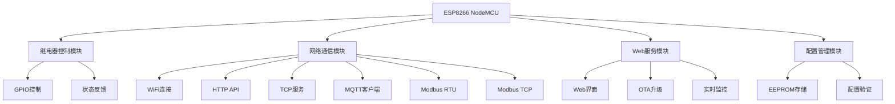

# RelayCtrl-4CH 技术架构文档 v1.0.1

## 🏗️ 系统架构概览

RelayCtrl-4CH采用模块化设计，基于ESP8266平台实现多协议工业继电器控制系统。



## 📁 代码结构

### 核心文件组织
```
src/
├── main.cpp              # 主程序入口和系统初始化
├── relay_controller.h    # 系统配置和全局声明
├── config.h             # 硬件配置和常量定义
├── web_handlers.cpp     # Web服务器和界面处理
├── mqtt_handlers.cpp    # MQTT协议通信处理
├── modbus_serial.cpp    # Modbus RTU和串口通信
└── tcp_server.cpp       # TCP服务器和Modbus TCP
```

### 文件功能矩阵

| 文件 | 主要功能 | 协议支持 | 硬件接口 | 配置管理 |
|------|---------|---------|---------|---------|
| main.cpp | 系统初始化、主循环、监控 | - | GPIO继电器 | EEPROM读写 |
| web_handlers.cpp | HTTP服务、Web界面 | HTTP/HTML | - | Web配置 |
| mqtt_handlers.cpp | MQTT通信 | MQTT | - | 订阅管理 |
| modbus_serial.cpp | 串口通信 | Modbus RTU | RS485 | 波特率配置 |
| tcp_server.cpp | 网络服务 | TCP/Modbus TCP | - | 端口配置 |

## 🔧 硬件抽象层

### GPIO映射表
```cpp
// 继电器控制引脚
#define RELAY_PIN_0    12  // D6 - JDQ0
#define RELAY_PIN_1    13  // D7 - JDQ1  
#define RELAY_PIN_2    14  // D5 - JDQ2
#define RELAY_PIN_3    16  // D0 - JDQ3

// RS485通信引脚
#define RS485_RX_PIN    4  // D2 - 接收
#define RS485_TX_PIN    5  // D1 - 发送
#define RS485_DE_PIN    2  // D4 - 方向控制
```

### 继电器控制接口
```cpp
class RelayController {
private:
    bool relayStates[4] = {false, false, false, false};
    int relayPins[4] = {RELAY_PIN_0, RELAY_PIN_1, RELAY_PIN_2, RELAY_PIN_3};
    
public:
    void init();                          // 初始化GPIO
    void setRelay(int relay, bool state); // 设置单个继电器
    void setAllRelays(bool state);        // 设置所有继电器
    bool getRelayState(int relay);        // 获取继电器状态
    String getStatusJson();               // 获取JSON状态
};
```

## 🌐 网络协议栈

### 1. HTTP API层
```
端点结构:
├── GET  /                     # Web主页
├── GET  /api/relays           # 获取所有继电器状态
├── POST /api/relay/{id}/{action} # 控制单个继电器
├── POST /api/relays/all/{action} # 批量控制
├── GET  /api/status           # 系统状态
└── POST /update               # OTA固件升级
```

### 2. TCP协议层
```cpp
// TCP服务器配置
class TCPServer {
private:
    WiFiServer server;
    int port;
    bool enabled;
    
public:
    void begin(int port);        // 启动服务器
    void handleClients();       // 处理客户端连接
    void processCommand(String cmd); // 处理命令
};

// 命令格式: RELAY:{0-3}:{ON|OFF|STATUS}
// 响应格式: OK:{RELAY_ID}:{STATE} 或 ERROR:{MESSAGE}
```

### 3. MQTT协议层
```cpp
// MQTT主题结构
Topics:
├── relay-ctrl/relays/0/set    # 控制继电器0
├── relay-ctrl/relays/1/set    # 控制继电器1
├── relay-ctrl/relays/2/set    # 控制继电器2
├── relay-ctrl/relays/3/set    # 控制继电器3
├── relay-ctrl/relays/status   # 状态发布
└── relay-ctrl/system/status   # 系统状态
```

### 4. Modbus协议层

#### Modbus RTU (串口)
```cpp
// 支持的功能码
Function Codes:
├── 0x01 - 读取线圈状态 (Read Coils)
├── 0x05 - 写单个线圈 (Write Single Coil)
└── 0x0F - 写多个线圈 (Write Multiple Coils)

// 寄存器映射
Coil Addresses:
├── 0x0000 - 继电器0状态
├── 0x0001 - 继电器1状态
├── 0x0002 - 继电器2状态
└── 0x0003 - 继电器3状态
```

#### Modbus TCP (网络)
```cpp
// MBAP Header Structure
typedef struct {
    uint16_t transaction_id;  // 事务标识符
    uint16_t protocol_id;     // 协议标识符 (0x0000)
    uint16_t length;          // 后续字节长度
    uint8_t  unit_id;         // 单元标识符
} MBAP_Header;

// TCP帧处理流程
1. 接收TCP数据
2. 解析MBAP头部
3. 验证Unit ID
4. 提取Modbus PDU
5. 处理功能码
6. 生成响应帧
7. 发送TCP响应
```

## 💾 配置管理系统

### EEPROM存储结构
```cpp
struct Config {
    // WiFi配置
    char ssid[32];           // WiFi名称
    char password[64];       // WiFi密码
    
    // 服务端口配置
    int httpPort;            // HTTP服务端口 (默认80)
    int tcpPort;             // TCP服务端口 (默认8080)
    int modbusTcpPort;       // Modbus TCP端口 (默认502)
    
    // MQTT配置
    bool mqttEnabled;        // MQTT启用状态
    char mqttServer[64];     // MQTT服务器地址
    int mqttPort;            // MQTT端口 (默认1883)
    char mqttUser[32];       // MQTT用户名
    char mqttPassword[32];   // MQTT密码
    
    // Modbus配置
    uint8_t modbusSlaveId;   // Modbus从机ID (默认2)
    int modbusBaudRate;      // Modbus波特率 (默认9600)
    bool modbusTcpEnabled;   // Modbus TCP启用状态
    
    // 系统配置
    bool tcpEnabled;         // TCP服务启用状态
    uint32_t magic;          // 配置魔术字 (验证有效性)
};
```

### 配置操作接口
```cpp
class ConfigManager {
public:
    static void loadConfig();    // 从EEPROM加载配置
    static void saveConfig();    // 保存配置到EEPROM
    static void resetConfig();   // 重置为默认配置
    static bool isValid();       // 验证配置有效性
};
```

## 🔄 系统生命周期

### 启动序列
```cpp
void setup() {
    1. 串口初始化 (115200 baud)
    2. GPIO配置 (继电器控制引脚)
    3. EEPROM配置加载
    4. WiFi连接 (WiFiManager)
    5. 服务启动:
       ├── HTTP服务器 (端口80)
       ├── TCP服务器 (端口8080) 
       ├── Modbus TCP (端口502)
       ├── MQTT客户端 (可选)
       └── RS485串口 (Modbus RTU)
    6. OTA升级服务
    7. 系统就绪提示
}
```

### 主循环
```cpp
void loop() {
    1. WiFi连接检查
    2. HTTP请求处理
    3. TCP客户端处理
    4. MQTT消息处理
    5. Modbus RTU命令处理
    6. Modbus TCP请求处理
    7. 系统状态监控 (30秒心跳)
    8. 看门狗喂食
}
```

## 📊 性能特征

### 资源使用 (v1.0.1)
```
内存使用:
├── 代码段: 550223 bytes (52.7% Flash)
├── 静态RAM: 52188 bytes (63.7% RAM)
├── 空闲堆: ~18712 bytes
└── 栈空间: ~4KB

实时性能:
├── GPIO切换时间: <10μs
├── HTTP响应时间: <50ms
├── TCP响应时间: <30ms
├── Modbus RTU响应: <50ms
├── Modbus TCP响应: <80ms
└── MQTT发布延迟: <100ms
```

### 并发能力
```
最大连接数:
├── HTTP同时连接: 4个
├── TCP并发连接: 5个
├── MQTT持久连接: 1个
└── Modbus RTU: 1个主站

吞吐量:
├── HTTP请求: ~20 req/s
├── TCP命令: ~50 cmd/s
├── Modbus RTU: ~10 frame/s
└── Modbus TCP: ~20 frame/s
```

## 🛡️ 安全机制

### 1. 输入验证
```cpp
// 参数验证示例
bool validateRelayId(int id) {
    return (id >= 0 && id < 4);
}

bool validateModbusFrame(uint8_t* frame, int length) {
    if (length < 4) return false;
    if (frame[0] != config.modbusSlaveId) return false;
    return crc16_check(frame, length);
}
```

### 2. 错误处理
```cpp
// 统一错误处理
typedef enum {
    SUCCESS = 0,
    ERROR_INVALID_RELAY,
    ERROR_INVALID_COMMAND,
    ERROR_MODBUS_CRC,
    ERROR_NETWORK_TIMEOUT
} ErrorCode;
```

### 3. 系统监控
```cpp
// 监控指标
struct SystemMetrics {
    uint32_t uptime;           // 运行时间
    uint32_t freeHeap;         // 可用内存
    int wifiRSSI;              // WiFi信号强度
    bool serviceStatus[6];     // 服务状态
    uint32_t requestCount;     // 请求计数
    uint32_t errorCount;       // 错误计数
};
```

## 🔧 调试与维护

### 调试接口
```cpp
// 调试输出等级
typedef enum {
    DEBUG_NONE = 0,
    DEBUG_ERROR,
    DEBUG_WARN,
    DEBUG_INFO,
    DEBUG_VERBOSE
} DebugLevel;

// 调试心跳 (30秒间隔)
void printDebugHeartbeat() {
    Serial.println("=== System Status Heartbeat ===");
    // 输出系统状态、内存使用、服务状态等
}
```

### 维护功能
```cpp
// 系统维护接口
void systemReset();          // 软重启
void configReset();          // 配置重置
void factoryReset();         // 恢复出厂设置
void diagnosticMode();       // 诊断模式
```

## 🚀 扩展能力

### 硬件扩展
- 支持更多继电器通道 (最多16路)
- 增加模拟量输入/输出
- 添加传感器接口

### 协议扩展  
- 支持更多Modbus功能码
- 添加BACnet协议支持
- 实现OPC UA客户端

### 功能扩展
- 定时任务调度
- 场景模式控制
- 数据记录和分析

---

**文档版本**: v1.0.1
**最后更新**: 2025年8月18日
**技术负责**: RelayCtrl-4CH 开发团队
